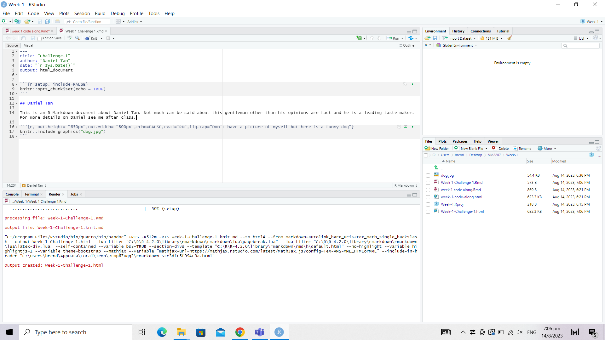

```{r setup, include=FALSE}
knitr::opts_chunk$set(echo = TRUE)
```

## Daniel Tan

This is an R Markdown document about Daniel Tan. Not much can be said about this gentleman other than his opinions are fact and he is a leading taste-maker. For more details on Daniel see me after class.

```{r, out.height= "100%",out.width= "100%",echo=FALSE,eval=TRUE,fig.cap="Don't have a picture of myself but here is a funny dog"}
 
```


```{r, out.height= "100%",out.width= "100%",echo=FALSE,eval=TRUE,fig.cap="Here's the layout"}
 
```